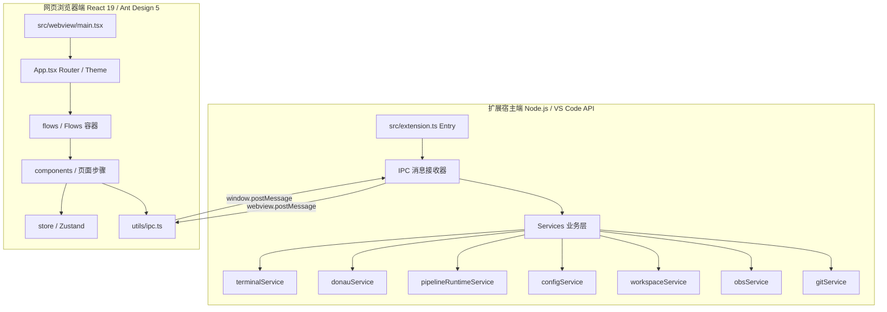

# DFT IDE 全景开发指南与架构文档

本指南旨在帮助开发人员快速熟悉 **DFT IDE** 项目的架构、代码结构和开发模式，并提供详细的上手修改与扩展指南。本项目的底层代码结构主要由 AI 辅助开发，通过本全景文档，你可以清晰地理解其运行机制、数据流向以及如何进行日常的开发和维护。

---

## 目录

1. [项目背景与核心功能](#1-项目背景与核心功能)
2. [系统架构设计 (双运行环境)](#2-系统架构设计-双运行环境)
3. [IPC 通信桥接机制](#3-ipc-通信桥接机制)
4. [状态管理与配置持久化](#4-状态管理与配置持久化)
5. [核心源码目录解析](#5-核心源码目录解析)
6. [进阶开发指南 (How-To)](#6-进阶开发指南-how-to)
7. [构建、调试与打包部署](#7-构建调试与打包部署)

---

## 1. 项目背景与核心功能

**DFT IDE** 是一个为集成电路 **DFT (Design for Test, 可测试性设计)** 工作流打造的 VS Code 扩展。它将 VS Code 编辑器转变为一个本地 DFT 工作台，把传统复杂的 DFT 工具链控制、集群提交、状态监控和同步操作收束到一个图形化的 Webview 面板中。

其核心功能包括：
- **项目主页与工作区管理**：快速打开/创建本地 DFT 工作区，解析项目目录。
- **公共配置 (Common Flow)**：统一配置和管理设计树（Design Tree）、归一化表格（Norm Table），并支持多仓之间的双向同步与 Git 提交。
- **设计工作流 (Hibist & Sailor)**：通过共享的 `FlowShell` 配合左侧模块设计树，实现 DFT 模块的依赖准备、环境生成、任务编排（集群/本地执行）、结果分析及数据提交。
- **仿真验证工作流 (Lander)**：流程化管理验证用例的执行、仿真日志监控以及结果报表的收集解析。
- **OBS 集成**：支持对接 OBS 服务，自动获取 SpaceToken，生成 AES-128-CBC 加密签名，并嵌入只读的文档预览器。
- **Donau 集成**：支持集群 Donau 资源查询与模拟任务提交、状态轮询。

---

## 2. 系统架构设计 (双运行环境)

DFT IDE 采用典型的 VS Code Webview 架构，分为**扩展宿主 (Extension Host)** 和 **网页端 (Webview)** 两个独立的运行环境：



### 2.1 扩展宿主端 (Extension Host)
- **运行环境**：Node.js。可直接访问系统文件、执行子进程（`child_process`）、调用本地二进制工具以及 VS Code API（终端、窗口、Git 扩展等）。
- **主要入口**：[src/extension.ts](file:///home/code/dft-ide/src/extension.ts)。
- **主要职责**：注册命令和树状视图、创建 Webview 窗口、处理 IPC 请求、读写底层本地配置文件、调度 Git / OBS / Donau 服务。

### 2.2 网页浏览器端 (Webview)
- **运行环境**：浏览器沙盒环境。无法直接访问本地 Node.js 模块或 VS Code API。
- **主要入口**：[src/webview/main.tsx](file:///home/code/dft-ide/src/webview/main.tsx)。
- **主要职责**：渲染 UI 组件、响应用户表单输入、调用 Zustand 管理运行时状态。当需要文件操作、Git 同步或运行终端时，通过 IPC 向扩展宿主发送消息并等待响应。

---

## 3. IPC 通信桥接机制

由于 Webview 被安全沙盒隔离，所有的本地交互必须通过**消息传递 (Message Passing)** 完成。项目在 [src/webview/utils/ipc.ts](file:///home/code/dft-ide/src/webview/utils/ipc.ts) 中实现了一套具有 **请求/响应关联 (Request-Response Correlation)** 的 IPC 机制。

### 3.1 关联原理
当 Webview 发起请求时，系统会生成一个自增的 `requestId`。然后将该 Promise 的 `resolve` 回调与 `${command}Response:${requestId}` 作为 Key 注册到全局 Map 中。扩展宿主端处理完毕后，回复带相同 `requestId` 的消息，触发 Map 中对应的回调，完成异步等待。

```typescript
// Webview 发送端实现 (src/webview/utils/ipc.ts)
function ipcRequest(command: string, payload: Record<string, unknown> = {}): Promise<Record<string, unknown>> {
  return new Promise((resolve, reject) => {
    const id = String(++_reqId);
    const responseKey = `${command}Response:${id}`;
    
    pendingCallbacks.set(responseKey, (data) => {
      resolve(data);
    });
    
    vscode.postMessage({ command, requestId: id, ...payload });
  });
}
```

### 3.2 常用 IPC 指令对照表

当你在开发中需要调用后台能力时，可以直接调用 [src/webview/utils/ipc.ts](file:///home/code/dft-ide/src/webview/utils/ipc.ts) 导出的封装函数。以下为核心 IPC 指令的对应关系：

| 指令 (command) | 说明 | 宿主处理逻辑及服务调用 |
| :--- | :--- | :--- |
| `getCurrentUser` | 获取当前操作系统工号 | 执行 `whoami` 获取系统工号 (有 settings 配置时优先) |
| `selectPath` | 弹出 VS Code 原生路径/文件选择器 | `vscode.window.showOpenDialog`，支持文件与目录区分 |
| `validatePath` | 校验用户输入路径是否存在且在仓库内 | `vscode.workspace.fs.stat` 校验，安全性防越界校验 |
| `openFile` | 在 VS Code 中打开指定路径的文件 | 文件调用文本编辑器打开，目录调系统管理器展示，Excel 调 GrapeCity 预览 |
| `readConfig` / `saveConfig` | 读取或写入 JSON 配置文件 | 使用 [configService.ts](file:///home/code/dft-ide/src/services/configService.ts)，支持浅合并以防止字段覆盖 |
| `readDesignTreeState` / `saveDesignTree` | 读写模块设计树与自动骨架生成 | 解析 `design_tree.mock.json` 并生成对应的模块配置文件框架 |
| `getGitInfo` / `getRepoGitInfo` | 获取选定仓库分支及变更状态 | 封装 VS Code 自带的 Git 扩展 API 获取版本信息 |
| `runRepoGitAction` | 执行 Git 常用动作 (pull, push, branch) | 调用宿主 [gitService.ts](file:///home/code/dft-ide/src/services/gitService.ts) 操作内置 Git 扩展 |
| `syncCommonArtifacts` | 复制并同步公共产物 (Design Tree / Norm Table) | 支持跨目录文件拷贝，提交并推送 Git (用于 Common 双向同步) |
| `getDonauResources` | 查询 Donau 集群的队列及账号资源状态 | 支持 mock/real 两种模式，real 模式下运行本地 shell 命令采集数据 |
| `submitTask` / `cancelTask` | 提交/取消 Mock Donau 批处理任务 | 开启定时器轮询任务状态 (SUCCESS, FAILED, RUNNING) |
| `openExecutionTerminal` | 打开 VS Code 终端并运行特定 Shell 命令 | 联动 VS Code `createTerminal`，用于前台执行编译/检查指令 |

---

## 4. 状态管理与配置持久化

### 4.1 Zustand 状态管理
Webview 侧的状态拆分为两大核心 Zustand Store：
1. **`useWizardStore`** ([src/webview/store/wizardStore.ts](file:///home/code/dft-ide/src/webview/store/wizardStore.ts))：
   - **`activeProject`**：当前选中的 DFT 项目名称与本地绝对路径。
   - **`flowContext`**：当前激活的流程种类（Welcome 首页、Common、Hibist、Sailor、Verification 等）。
   - **`dirtyFlows`**：标记哪些流程有未保存的表单变更。用户尝试切换 Tab 时，若该 Flow 在 `dirtyFlows` 中，系统会弹出 Modal 确认拦截，防止配置丢失。
   - **`zenMode`**：是否处于 IDE 专注开发模式（开启后会自动收起 VS Code 的活动栏与菜单栏，最大化工作区）。
2. **`usePipelineRuntimeStore`** ([src/webview/store/pipelineRuntimeStore.ts](file:///home/code/dft-ide/src/webview/store/pipelineRuntimeStore.ts))：
   - 追踪当前模块在流水线中各 Task 的执行状态（pending、running、success、failed）、日志内容及运行时快照。

### 4.2 本地配置持久化原则
用户在 Webview 表单填写的配置不会被直接发往远端数据库，而是采用**文件驱动**的持久化方案：
- **存储路径**：默认存放在 `.dft-ide/local-state/` 目录下。如果在 VS Code 中配置了 `dftIde.localConfigPath`，则会存储到该全局自定义目录下（按 `项目名-路径哈希` 隔离子文件夹）。
- **同步机制**：`.dft-ide/` 目录通常在保存配置时会被自动追加写入 `.gitignore` 中，确保本地用户级临时状态不会被意外提交至远端代码仓库。
- **更新策略**：[configService.ts](file:///home/code/dft-ide/src/services/configService.ts) 的 `mergeConfigFile` 方法使用浅合并的方式写入 JSON。即只更新表单提交的键值对，这保证了不同 Tab 页面在写入同一个配置文件时，不会覆盖掉彼此的私有字段。

### 4.3 设计树与模块骨架自动生成
设计树组件 ([DesignTreePanel.tsx](file:///home/code/dft-ide/src/webview/components/shared/DesignTreePanel.tsx)) 是设计与验证流程的核心入口。
- 当用户在 Common Tab 选定了有效的设计树路径（指向 `design_tree.mock.json`），系统会加载并展示树状模块。
- 每次保存设计树时，系统会自动在本地生成对应 Flow（如 Hibist 或 Sailor）下各个选中模块的**配置骨架 JSON**。
- 这为用户后续点击模块并进入 Tool Step 配置时，预先提供了合法的默认 JSON 结构，从而将全局设计树与模块化微观配置有机地结合在一起。

---

## 5. 核心源码目录解析

```text
src/
|-- extension.ts                     # VS Code 扩展宿主入口。包含命令注册、IPC 路由与 Webview 窗口实例化。
|-- webviewHtml.ts                   # 动态生成包含 React 脚本和 CSS 的 Webview HTML。支持主题类名注入。
|-- services/                        # 扩展宿主侧服务 (Node 运行环境)
|   |-- gitService.ts                # VS Code Git 扩展接口封装 (分支、拉取、推送、提交)
|   |-- obsService.ts                # 签名与 OBS SpaceToken 获取，构建 viewer URL
|   |-- donauService.ts              # 封装集群 Donau 客户端接口及 mock 任务状态生成
|   |-- pipelineRuntimeService.ts    # 流水线配置文件加载器与执行管理器。调度本地命令或打开终端。
|   |-- configService.ts             # 读写 local-state JSON 配置文件，提供安全路径和 merge 机制
|   |-- workspaceService.ts          # DFT IDE 项目选择、多仓工作区初始化及路径校验
|   |-- layoutService.ts             # VS Code 专注开发模式界面显示配置
|   `-- terminalService.ts           # VS Code 终端打开服务及运行历史本地序列化
`-- webview/                         # 网页前端侧源码 (浏览器运行环境)
    |-- main.tsx                     # React 19 挂载入口，获取宿主注入的初始状态
    |-- App.tsx                      # 顶层布局，实现 AntD 样式自适应、流程 Tab 切换与未保存防丢失拦截
    |-- flows/                       # 流程容器组件
    |   |-- CommonFlow.tsx           # 公共配置流，负责 Norm Table/Design Tree 数据对比、两仓合并同步
    |   |-- DesignFlow.tsx           # 整合 Hibist/Sailor 的 FlowShell 容器，挂载左侧设计树
    |   `-- VerificationFlow.tsx     # 仿真验证工作流容器
    |-- store/                       # Zustand 全局 Store (wizardStore, pipelineRuntimeStore)
    |-- hooks/                       # 常用 React 钩子 (useFlowConfig 统一配置读写, useVscodePath 关联选择器)
    |-- utils/                       # 前端辅助工具 (ipc.ts 封装所有异步请求，vscode.ts 导出 postMessage)
    `-- components/                  # UI 子组件
        |-- Welcome.tsx              # 项目首页，支持查找本地工作区、配置全局状态目录
        |-- ProjectMembers.tsx       # 团队成员工号、角色列表维护
        `-- shared/                  # 共享 UI 组件
            |-- DesignTreePanel.tsx  # 模块设计树，支持多选运行、右键重命名/复制、按骨架生成配置
            |-- ObsViewer.tsx        # OBS 浏览器，包含 SpaceToken 生成与 fs-signature 校验展示
            |-- PathInput.tsx        # 自定义路径输入框，内置 VS Code 目录选择与存在性校验按钮
            `-- PipelineRuntimeView.tsx # 流水线 DAG 可视化渲染图 (基于 @xyflow/react)
```

---

## 6. 进阶开发指南 (How-To)

本章提供详细的场景化指南，教你如何向 DFT IDE 中添加新功能。

### 6.1 场景一：添加一个全新的 DFT 流程 (例如：形式验证 Formal Flow)

目前 Formal 和 STA 流程为规划中的置灰 Tab，添加它们的步骤如下：

#### 第一步：在扩展宿主端注册流程命令
在 [src/extension.ts](file:///home/code/dft-ide/src/extension.ts) 中的 `FLOW_CONFIGS` 或者 `registerCommand('dftIde.openFlow')` 中允许打开 `Formal`：
```typescript
// src/extension.ts L158-L165 左右
vscode.commands.registerCommand('dftIde.openFlow', async (category: string) => {
  if (category === 'STA') { // 移除 Formal 限制
    vscode.window.showInformationMessage('该流程仍在开发中，暂不可打开。');
    return;
  }
  await openWebviewFlow(context, category);
});
```

#### 第二步：在 Webview App 中注册元数据与使能导航
在 [src/webview/App.tsx](file:///home/code/dft-ide/src/webview/App.tsx) 中：
1. 移除 `disabledTabs` 中对 `'Formal'` 的限制：
   ```typescript
   const disabledTabs = new Set(['STA']); // 移除了 'Formal'
   ```
2. 在 `flowMeta` 中定义它的标题、描述和色调：
   ```typescript
   Formal: {
     title: '形式验证工作流配置',
     subtitle: '围绕 Formality 工具链完成模块等价性检查与分析。',
     accent: '#d97706', // 琥珀色
   }
   ```

#### 第三步：创建流程容器组件
在 `src/webview/flows/` 下创建 `FormalFlow.tsx`。你可以直接复用已有的 `FlowShell` 骨架：
```tsx
import React, { useState } from 'react';
import FlowShell from '../components/shared/FlowShell';
import DesignTreePanel from '../components/shared/DesignTreePanel';
import { useFlowConfig } from '../hooks/useFlowConfig';

const FormalFlow: React.FC = () => {
  const [currentStep, setCurrentStep] = useState(0);
  const [selectedModule, setSelectedModule] = useState('');
  const { savedData, handleSave } = useFlowConfig('formal');

  const steps = [
    { title: '环境准备', description: '配置基础路径', content: <div>配置表单...</div> },
    { title: '任务执行', description: '提交 Formality 任务', content: <div>执行面板...</div> },
    { title: '结果分析', description: '查看报告及 Debug', content: <div>报告...</div> }
  ];

  return (
    <FlowShell
      accent="#d97706"
      eyebrow="Formal Flow"
      title="Formal 形式验证任务编排"
      description="配置和管理 Formality 形式验证流程"
      steps={steps}
      current={currentStep}
      onStepChange={setCurrentStep}
      sidebar={
        <DesignTreePanel
          accent="#d97706"
          flow="formal" // 对应配置名
          flowLabel="Formal"
          selectedKey={selectedModule}
          onSelect={setSelectedModule}
        />
      }
    />
  );
};

export default FormalFlow;
```

#### 第四步：在 App.tsx 中渲染该流程
在 [src/webview/App.tsx](file:///home/code/dft-ide/src/webview/App.tsx) 的 `renderFlowContent` 方法中加入 Formal 的路由分支：
```tsx
// 引入组件
import FormalFlow from './flows/FormalFlow';

// 在 renderFlowContent 内部的 switch (category) 里：
case 'Formal':
  return <FormalFlow />;
```

此时重新编译运行，你就可以在左侧导航栏点击「形式验证」并进入全新的工作流界面了。

---

### 6.2 场景二：添加一个新的 IPC 命令 (例如：获取服务器磁盘剩余空间 `getDiskSpace`)

当 Webview 页面需要知道服务器某路径下的剩余磁盘空间时，我们需要在宿主端读取并返回给前端：

#### 第一步：在 Webview IPC 客户端定义请求接口
在 [src/webview/utils/ipc.ts](file:///home/code/dft-ide/src/webview/utils/ipc.ts) 中增加一个导出函数：
```typescript
export async function getDiskSpace(targetPath: string): Promise<{ success: boolean; freeGb?: number; error?: string }> {
  // 向扩展端发送 getDiskSpace 指令，等待其响应
  const res = await ipcRequest('getDiskSpace', { targetPath });
  return res as { success: boolean; freeGb?: number; error?: string };
}
```

#### 第二步：在扩展宿主端添加 IPC 处理器
在 [src/extension.ts](file:///home/code/dft-ide/src/extension.ts) 中的 `currentPanel.webview.onDidReceiveMessage` 内添加 `switch case`：
```typescript
// src/extension.ts 的 message 监听器中
case 'getDiskSpace': {
  const requestId: string = msg.requestId;
  const targetPath = typeof msg.targetPath === 'string' ? msg.targetPath : '';
  try {
    // 示例代码：使用 node 的 fs.statfs (如果 node 版本支持) 或 shell 命令获取空间
    // 这里做模拟返回
    const freeGb = 120; // 模拟 120 GB 可用
    currentPanel?.webview.postMessage({
      command: 'getDiskSpaceResponse', // 注意：必须是 ${command}Response 格式
      requestId,
      success: true,
      freeGb,
    });
  } catch (err) {
    currentPanel?.webview.postMessage({
      command: 'getDiskSpaceResponse',
      requestId,
      success: false,
      error: String(err),
    });
  }
  return;
}
```

#### 第三步：在 React 组件中调用该 IPC 接口
```tsx
import { getDiskSpace } from '../utils/ipc';

// 在 React 组件中异步调用：
const checkSpace = async () => {
  try {
    const result = await getDiskSpace('/home/code/dft-ide');
    if (result.success) {
      console.log(`可用磁盘空间为: ${result.freeGb} GB`);
    } else {
      console.error('检查失败:', result.error);
    }
  } catch (err) {
    console.error('IPC 超时或通信失败', err);
  }
};
```

---

### 6.3 场景三：自定义流水线执行步骤 (Pipeline Customization)

设计与验证页面上的流水线执行步骤是动态生成的，其结构由 [src/services/pipelineRuntimeService.ts](file:///home/code/dft-ide/src/services/pipelineRuntimeService.ts) 管理。
- **默认步骤**：如果你需要修改默认执行的指令或添加全局默认步骤，可以直接修改 `pipelineRuntimeService.ts` 中的 `DEFAULT_PIPELINE_TASKS` 结构体（Hibist / Sailor / Verification 分别有各自的默认指令列表）。
- **项目级自定义**：流水线支持**项目定制化**。系统会在当前项目的工作区目录下寻找 `pipelines/hibist.yaml`、`pipelines/sailor.yaml` 或 `pipelines/lander.yaml` 文件。
  - 用户只需编辑这些 YAML 配置文件，添加、删除步骤或更改 `command`，刷新 Webview 后，前端的流水线 DAG 拓扑图和执行按钮就会自动更新。
  - YAML 的格式非常简单，如下所示：
    ```yaml
    - id: my_custom_step
      name: 自定义前置ECO
      command: "sh eco_run.sh"
      description: 执行前置网表检查与ECO修复
    ```

---

## 7. 构建、调试与打包部署

### 7.1 开发命令汇总

项目的构建与打包使用 `esbuild` 完成，相关脚本声明在 `package.json` 中：

- **安装依赖**：
  ```bash
  npm install
  ```
- **一次性全量编译**（会同时打包扩展端代码、Webview 页面和 Workbook 同步服务）：
  ```bash
  npm run compile
  ```
- **开启增量监听编译**（推荐在日常开发中后台开启，保存文件时会自动热重载产物）：
  ```bash
  npm run watch
  ```
- **TypeScript 类型检查**（编译阶段为提升速度不进行类型校验，提交代码前请用此命令校验）：
  ```bash
  npm run check
  ```
- **打包为 VSIX 安装包**：
  ```bash
  npx @vscode/vsce package
  ```

### 7.2 调试指南

1. **环境准备**：使用 VS Code 打开项目文件夹。在终端运行 `npm run watch` 保持监听状态。
2. **启动调试**：按下快捷键 `F5`（或在运行与调试面板选择 `Run DFT IDE Extension` 配置）。
3. **功能验证**：VS Code 会弹出一个临时的「扩展开发宿主」新窗口。在新窗口的左侧活动栏（Activity Bar）中，点击 DFT 标志（或在控制台运行 `DFT IDE: Open Home` 命令），即可拉起图形化 Webview 窗口。
4. **日志查看**：
   - **扩展端日志**：可以直接在父窗口的 VS Code 「调试控制台 (Debug Console)」中查看到所有的 `console.log` 以及错误堆栈。
   - **Webview 端日志**：在弹出的 Webview 页面上，按下快捷键（Windows: `Ctrl+Shift+I` / Mac: `Cmd+Option+I`）或执行命令 `Developer: Toggle Developer Tools` 调出浏览器的控制台，即可查看前端 DOM、React 状态以及网络请求。

### 7.3 构建产物说明
- 打包输出目录为 `out/`。请勿手动修改该目录下的任何文件，它们每次都会被 esbuild 覆写。
- 打包发布 VSIX 时，`.vscodeignore` 已经排除了所有的源文件 (`src/`)、本地配置文件、类型配置和开发依赖，只保留了运行所需的 `out/` 产物、图标及清单。这可以确保打包生成的插件体积小巧、安装快速。

---

祝你开发顺利！如在后续上手修改中有任何疑问，可参考 [README.zh-CN.md](file:///home/code/dft-ide/README.zh-CN.md) 了解更通用的配置规则，或阅读 [AGENTS.md](file:///home/code/dft-ide/AGENTS.md) 获取更底层环境信息。
