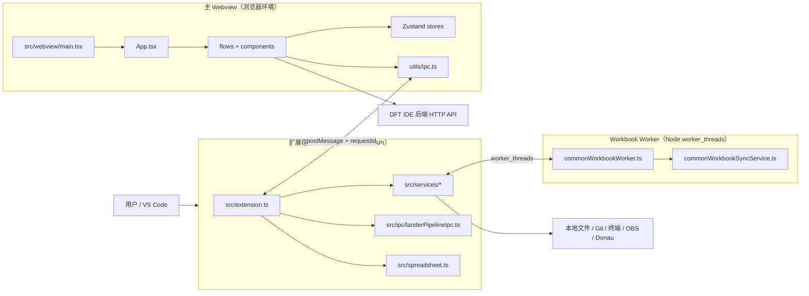

# DFT IDE 全景开发指南与架构文档

本文面向需要阅读、维护或扩展 DFT IDE 的开发人员，描述当前代码库的真实结构、运行边界、主要数据流和常见修改入口。

> 文档基线：2026-07-23。若本文与源码不一致，以 `src/`、`scripts/build.mjs` 和 `package.json` 为准。

## 目录

1. [项目定位与当前能力](#1-项目定位与当前能力)
2. [总体架构与运行边界](#2-总体架构与运行边界)
3. [启动、导航与工作区模型](#3-启动导航与工作区模型)
4. [Webview 与扩展宿主 IPC](#4-webview-与扩展宿主-ipc)
5. [状态管理与本地持久化](#5-状态管理与本地持久化)
6. [工作流与流水线执行](#6-工作流与流水线执行)
7. [扩展宿主服务层](#7-扩展宿主服务层)
8. [核心源码目录](#8-核心源码目录)
9. [关键数据流](#9-关键数据流)
10. [常见开发任务](#10-常见开发任务)
11. [构建、测试、调试与打包](#11-构建测试调试与打包)
12. [维护约定与已知边界](#12-维护约定与已知边界)

## 1. 项目定位与当前能力

DFT IDE 是一个 VS Code 扩展，把本地 DFT 项目管理、公共数据同步、设计流程、验证流程、终端执行、日志诊断以及 OBS、Git、GitLab、Donau 等能力集中到一个 Webview 工作台中。

项目当前属于可运行的 demo/foundation，而不是完整生产级 IDE。已有的主要能力包括：

- 项目首页、项目创建/初始化、成员和领域管理。
- `data`、`hibist`、`sailor`、`verification` 四仓工作区管理。
- Common 公共配置、Design Tree、归一化表格以及跨仓同步。
- Hibist、Sailor 设计工作流和 Lander 验证工作流。
- YAML 驱动的流程步骤、终端执行、任务状态、历史记录和日志诊断。
- Git 状态、分支、提交、拉取、推送及引导式冲突处理。
- `.xls` / `.xlsx` 自定义编辑器、工作簿差异和单元格级合并。
- OBS 文件浏览、下载、只读预览、版本跟踪和后台更新检查。
- Donau 资源查询，以及 mock 任务提交与取消。
- Formal 和 STA 仅保留导航入口，当前仍禁用。

## 2. 总体架构与运行边界

当前代码包含三个独立执行单元：



### 2.1 扩展宿主

入口是 [`src/extension.ts`](src/extension.ts)。这里可以使用 Node.js、VS Code API、文件系统、子进程、终端和内置 Git 扩展。

主要职责：

- 注册 Activity Bar、Tree View、命令和自定义编辑器。
- 创建并复用一个主 Webview Panel。
- 接收 Webview 消息，并将操作委托给 `src/services/`。
- 向 Webview 返回请求结果或推送流水线状态。
- 初始化 OBS 后台跟踪、只读文档 provider 和诊断集合。

### 2.2 主 Webview

入口是 [`src/webview/main.tsx`](src/webview/main.tsx)，顶层应用是 [`src/webview/App.tsx`](src/webview/App.tsx)。

Webview 负责 React UI、Ant Design 主题、流程路由、表单交互和浏览器端状态。它不能直接导入 `vscode` 或 Node.js 模块；需要本地能力时必须调用 [`src/webview/utils/ipc.ts`](src/webview/utils/ipc.ts)。

Webview 可以直接调用后端 HTTP API。项目、成员、领域和执行上报被集中封装在 [`src/webview/services/projectService.ts`](src/webview/services/projectService.ts)。

### 2.3 Workbook Worker

公共工作簿比较和合并可能是 CPU 密集操作。扩展宿主通过 [`commonWorkbookWorkerClient.ts`](src/services/commonWorkbookWorkerClient.ts) 为每次请求启动 `worker_threads.Worker`，运行编译后的 `out/commonWorkbookWorker.js`。

Worker 只处理可序列化的工作簿任务，不使用 VS Code API。这样可以避免大型 Excel 比较阻塞扩展宿主。

### 2.4 Spreadsheet 自定义编辑器

[`src/spreadsheet.ts`](src/spreadsheet.ts) 实现 `CustomReadonlyEditorProvider`，负责：

- 打开 `.xls` / `.xlsx`。
- 渲染工作簿内容。
- 配对 Git 虚拟文档与工作区文件，显示单元格级差异。
- 对普通文件接收保存消息。

它有独立 Webview，但不属于 `src/webview/main.tsx` 启动的主 React 应用。

## 3. 启动、导航与工作区模型

### 3.1 激活流程

扩展在 `onStartupFinished` 激活。`activate()` 主要执行：

1. 加载环境变量和环境默认值。
2. 初始化 `PipelineRuntimeService`。
3. 初始化 OBS Tracking。
4. 注册 OBS 只读文档 provider。
5. 注册 Tree View、命令、自定义 Spreadsheet Editor 和诊断资源。
6. 创建或打开 DFT 工作台。

命令和配置声明位于 [`package.json`](package.json)，实际注册位于 [`src/extension.ts`](src/extension.ts)。

### 3.2 导航层级

Activity Bar 下的 Tree View 由 `FLOW_CONFIGS` 生成。当前入口为：

| 分类 | Webview 内容 | 状态 |
| --- | --- | --- |
| HOME | `Welcome` | 可用 |
| Common | `CommonFlow` | 可用 |
| Hibist | `DesignFlow category="Hibist"` | 可用 |
| Sailor | `DesignFlow category="Sailor"` | 可用 |
| Verification | `VerificationFlow`（Lander） | 可用 |
| Formal | 预留 | 禁用 |
| STA | 预留 | 禁用 |

项目成员管理和领域管理不是 Tree View 一级流程，而是从首页进入的内部页面。

扩展宿主只维护一个 `currentPanel`。再次选择流程时会复用 Panel，并发送：

```ts
{ command: 'showWelcome' }
// 或
{ command: 'loadFlow', category: 'Hibist' }
```

同一份初始指令也会由 [`src/webviewHtml.ts`](src/webviewHtml.ts) 注入 `window.DFT_IDE_INITIAL_VIEW`。后端地址通过 `window.DFT_IDE_API_BASE` 注入。

### 3.3 项目与多仓工作区

一个 DFT 项目通常包含四个仓库：

```text
<project-root>/
├── data/
├── hibist/
├── sailor/
├── verification/
├── .dft-ide/
│   └── local-state/
└── dft-ide.code-workspace
```

`workspaceService` 负责项目根目录识别、仓库查找、工作区文件生成、仓库初始化和路径校验。

`resolveProjectRoot()` 的主要规则是：

- 如果打开了两个及以上同父目录的标准仓库文件夹，则父目录是项目根。
- 否则使用第一个工作区文件夹的父目录。

因此，涉及项目路径的代码应优先调用 `workspaceService`，不要在组件或 IPC case 中自行推断路径。

## 4. Webview 与扩展宿主 IPC

### 4.1 请求/响应协议

[`src/webview/utils/ipc.ts`](src/webview/utils/ipc.ts) 中的 `ipcRequest()` 为每个请求生成 `requestId`：

```ts
vscode.postMessage({
  command: 'readConfig',
  requestId,
  flow: 'common',
});
```

扩展宿主必须使用相同 `requestId`，并将响应命令命名为 `${command}Response`：

```ts
currentPanel?.webview.postMessage({
  command: 'readConfigResponse',
  requestId,
  success: true,
  data,
});
```

Webview 以 `${responseCommand}:${requestId}` 查找等待中的 Promise。请求默认有超时保护；命令名或 `requestId` 不匹配会导致调用方一直等到超时。

`openFile`、`openSourceControl` 等不需要结果的操作使用单向 `vscode.postMessage()`。

### 4.2 服务端路由位置

大多数 IPC 路由仍集中在 `openWebviewFlow()` 内的 `currentPanel.webview.onDidReceiveMessage`。Lander mode pipeline 查询已经拆到 [`src/ipc/landerPipelineIpc.ts`](src/ipc/landerPipelineIpc.ts)，可作为后续拆分复杂路由的参考。

### 4.3 IPC 能力分组

下表按职责归纳当前主要命令，不穷举每个辅助命令：

| 分组 | 代表命令 | 主要实现 |
| --- | --- | --- |
| 用户与设置 | `getCurrentUser`、`getConfiguration`、`updateConfiguration` | `extension.ts`、VS Code Configuration |
| 项目与路径 | `selectPath`、`validatePath`、`prepareProjectWorkspace`、`enterProjectWorkspace` | `workspaceService.ts` |
| 配置与设计树 | `readConfig`、`saveConfig`、`readDesignTreeState`、`saveDesignTree` | `configService.ts`、`designTreeService.ts` |
| Flow 配置文件 | `listFlowConfigFiles`、`create/duplicate/rename/deleteFlowConfigFile` | `configService.ts` |
| 配置生成 | `generateDefaultFlowConfigs`、`generateLanderConfigs`、`fetchTransformLogs` | `configService.ts`、`workspaceService.ts` |
| Git 与同步 | `getRepoGitInfo`、`runRepoGitAction`、`startGuidedRepoSync`、`syncCommonArtifacts` | `gitService.ts`、`syncService.ts` |
| OBS | `listObsChildren`、`downloadObsPath`、`openObsFileReadOnly`、`openObsViewer` | `obsService.ts`、`obsTrackingService.ts`、`obsPreviewService.ts` |
| 流水线 | `getPipelineRuntimes`、`start/stopPipelineRuntime`、`select/stop/rerunPipelineTask` | `pipelineRuntimeService.ts` |
| Lander | `append/get/removeLanderStage`、`getLanderModePipelines` | `extension.ts`、`landerPipelineIpc.ts`、`landerPipelineService.ts` |
| 终端与历史 | `openExecutionTerminal`、`saveExecutionHistory`、`getExecutionHistory` | `terminalService.ts` |
| Donau | `getDonauResources`、`submitTask`、`cancelTask` | `donauService.ts` |
| 编辑器与外部入口 | `openFile`、`openFileReadonly`、`openVsCodeDiff`、`openExternalUrl` | VS Code API、系统 shell |

新增 IPC 时必须同时更新 Webview 封装和扩展宿主处理器。跨越文件系统、终端、Git 或 VS Code UI 的实现必须留在扩展宿主侧。

## 5. 状态管理与本地持久化

### 5.1 Webview 运行时状态

Webview 当前有三个 Zustand Store：

| Store | 文件 | 责任 |
| --- | --- | --- |
| Wizard Store | [`wizardStore.ts`](src/webview/store/wizardStore.ts) | 当前步骤、活动项目、流程上下文、当前用户、未保存标记、Zen Mode |
| Module Store | [`moduleStore.ts`](src/webview/store/moduleStore.ts) | 各流程的模块列表 |
| Pipeline Runtime Store | [`pipelineRuntimeStore.ts`](src/webview/store/pipelineRuntimeStore.ts) | Hibist/Sailor/Verification 的任务图、日志、运行状态和选择状态 |

`pipelineRuntimeStore` 会订阅扩展宿主主动推送的 `pipelineRuntimeUpdated` 消息，并使用 [`pipelineRuntimeMerge.ts`](src/webview/store/pipelineRuntimeMerge.ts) 按 `updatedAt` 合并快照，防止旧消息覆盖新状态。

这些 Store 是 Webview 内存状态。需要跨窗口或跨启动保存的数据应走配置文件或 VS Code Configuration。

### 5.2 本地状态目录

当前项目状态固定解析到：

```text
<project-root>/.dft-ide/local-state/
```

`resolveConfigPath(flow)` 会清理每个路径段，并把最后一段转换为 JSON 文件。例如：

```text
common                       -> .dft-ide/local-state/common.json
hibist                       -> .dft-ide/local-state/hibist.json
hibist/<module>/config       -> .dft-ide/local-state/hibist/<module>/config.json
verification/<mode>/config   -> .dft-ide/local-state/verification/<mode>/config.json
```

`saveConfig` 使用浅合并语义：只合并顶层字段。嵌套对象如果需要局部保留，调用方应先在 Webview 中完成嵌套合并，或者为它设计独立的保存结构。

`.dft-ide/` 会被加入项目 `.gitignore`，避免本机状态意外进入业务仓库。

### 5.3 Flow `.cfg` 文件

Hibist、Sailor 和 Verification 还维护真实工具配置文件。其目录通过 `getFlowConfigsDirectory()` 解析，支持：

- 列表、创建、复制、重命名和删除 `.cfg`。
- 从归一化表格读取模块。
- 下载 OBS 生成脚本并执行转换。
- 保存和读取转换日志。

这些 `.cfg` 与 `.dft-ide/local-state/*.json` 的作用不同：前者是工具/仓库侧配置，后者是 IDE 页面状态。

### 5.4 Design Tree

读取优先级为：

1. 当前 flow 已同步到目标仓库的 Design Tree。
2. Common 配置中 `designTree` 指定的文件；如果配置的是目录，则使用 `design_tree.mock.json`。
3. Common 本地状态中的 `designTreeDraft`。

保存 Design Tree 后，`designTreeService` 会：

- 写入目标文件或 Common Draft。
- 更新 flow 级 `modules` 和 `activeModuleKey`。
- 为每个模块更新 `<flow>/<module>/config.json` 骨架。

## 6. 工作流与流水线执行

### 6.1 页面工作流

- [`CommonFlow.tsx`](src/webview/flows/CommonFlow.tsx)：公共路径、仓库状态、工作簿差异、Design Tree 与同步。
- [`DesignFlow.tsx`](src/webview/flows/DesignFlow.tsx)：复用同一容器呈现 Hibist 和 Sailor。
- [`VerificationFlow.tsx`](src/webview/flows/VerificationFlow.tsx)：Lander 验证流程、stage、mode、参数和运行入口。
- [`FlowShell.tsx`](src/webview/components/shared/FlowShell.tsx)：设计/验证类分步页面的公共外壳。

设计流程的通用步骤组件位于 `components/design/`，验证流程位于 `components/verification/`。Verification 的 mode 页面已经进一步拆分为 CRUD、资源、选择、运行等 hooks。

### 6.2 Pipeline 定义

基础任务图定义在：

```text
pipelines/
├── hibist.yaml
├── sailor.yaml
├── lander.yaml
└── lander_<preMode>.yaml
```

Lander mode YAML 由 [`landerPipelineService.ts`](src/services/landerPipelineService.ts) 使用 `yaml` 解析，并用 Zod 校验。每个步骤至少包含：

```yaml
- id: create_project
  name: create_project
  command: run_flow_lander
  description: 创建运行环境
  enableGroup: false
  enableTC: false
  enableSubAttr: false
```

`preMode` 只允许字母、数字、下划线和连字符，最终映射到 `pipelines/lander_<preMode>.yaml`。

### 6.3 Pipeline Runtime

[`pipelineRuntimeService.ts`](src/services/pipelineRuntimeService.ts) 在扩展宿主中维护运行会话：

1. 根据 flow/module 创建任务和连线快照。
2. 读取环境配置、模块配置和运行参数。
3. 通过 VS Code Terminal 执行步骤。
4. 监听终端数据，识别步骤开始/结束标记。
5. 更新任务状态、日志和整体 `runState`。
6. 向 Webview 推送快照。
7. 结束后保存执行历史。

终端 shell 默认来自 `dftIde.pipeline.shellPath`，当前默认值为 `csh`。脚本位于 `scripts/`，ECO 脚本位于 `scripts/eco/`，配置转换入口位于 `scripts/transform/`。

## 7. 扩展宿主服务层

`src/services/` 的当前职责如下：

| 文件 | 主要职责 |
| --- | --- |
| `constants.ts` | View Type、状态目录、OBS URI Scheme、标准仓库名等常量 |
| `workspaceService.ts` | 项目根、工作区、仓库、路径、默认状态、配置转换 |
| `configService.ts` | JSON 状态、`.cfg` 文件、OBS 脚本、转换日志 |
| `designTreeService.ts` | Design Tree 读取/保存和模块骨架生成 |
| `gitService.ts` | VS Code 内置 Git API 的底层封装 |
| `gitlabService.ts` | GitLab Host 配置读取 |
| `syncService.ts` | 多仓友好状态、引导式冲突、提交到云端、公共产物同步 |
| `commonSyncArtifacts.ts` | 公共同步产物路径建模 |
| `commonWorkbookSyncService.ts` | Excel 比较、复制和单元格级合并 |
| `commonWorkbookWorkerClient.ts` | Workbook Worker 生命周期和请求协议 |
| `commonWorkbookWorker.ts` | Worker 入口 |
| `obsService.ts` | OBS Token、签名、目录、详情、上传、下载、版本和 Viewer URL |
| `obsTrackingService.ts` | OBS 本地元数据、版本策略、后台更新检查和并发下载 |
| `obsPreviewService.ts` | `dft-obs-readonly:` 临时文档和只读预览 |
| `donauService.ts` | Donau mock/real/auto 资源查询和 mock 作业状态 |
| `pipelineRuntimeService.ts` | 流水线会话、终端步骤调度、快照和历史 |
| `landerPipelineService.ts` | Lander mode YAML 加载与 Zod 校验 |
| `terminalService.ts` | 终端打开、数据监听、停止和执行历史 |
| `diagnosticsService.ts` | DFT 日志解析与 VS Code Diagnostics |
| `layoutService.ts` | DFT 专注布局应用和恢复 |
| `demoService.ts` | VS Code API 演示动作 |
| `utils.ts` | 子进程、文件、JSON 和通用解析函数 |

环境相关默认值集中在 [`src/config/environment.ts`](src/config/environment.ts)，构建时通过 `process.env.DFT_IDE_BUILD_ENV` 区分 development 和 production。

## 8. 核心源码目录

以下目录树描述源码职责，不列出每一个叶子组件：

```text
.
├── assets/                         # Activity Bar 和扩展图标
├── deploy/                         # 便携 IDE 打包脚本与说明
├── docs/
│   └── OBS_API.zh-CN.md            # OBS API 与跟踪约定
├── pipelines/                      # Hibist/Sailor/Lander YAML 步骤
├── scripts/
│   ├── build.mjs                   # ext/webview/worker 三目标构建
│   ├── run_flow_*                  # 正常流程脚本
│   ├── eco/                        # ECO 流程脚本
│   └── transform/                  # cfg 生成入口
├── src/
│   ├── config/
│   │   └── environment.ts          # 环境默认值
│   ├── ipc/
│   │   └── landerPipelineIpc.ts    # 已拆出的 Lander IPC handler
│   ├── services/                   # 扩展宿主业务层和 Workbook Worker
│   ├── webview/
│   │   ├── components/
│   │   │   ├── design/             # Hibist/Sailor 步骤
│   │   │   ├── verification/       # Lander 步骤与 mode 页面
│   │   │   ├── shared/             # FlowShell、Design Tree、Pipeline、OBS、Git 等
│   │   │   ├── temporary/          # 临时 OBS Browser
│   │   │   └── wizard/             # 旧版通用向导 fallback
│   │   ├── flows/                  # Common、Design、Verification 容器
│   │   ├── hooks/                  # 配置和路径 hooks
│   │   ├── services/               # Webview 后端 API client
│   │   ├── store/                  # Zustand stores
│   │   ├── utils/                  # IPC 与 acquireVsCodeApi 封装
│   │   ├── App.tsx                 # 路由、主题、顶部导航
│   │   └── main.tsx                # React 入口
│   ├── extension.ts                # 扩展激活、命令、主 IPC 路由
│   ├── spreadsheet.ts              # XLS/XLSX 自定义编辑器
│   └── webviewHtml.ts              # 主 Webview HTML 与初始全局变量
├── tests/                          # Vitest 单元测试
├── package.json                    # 扩展 Manifest、设置、脚本、依赖
└── tsconfig.json                   # TypeScript strict 配置
```

`out/` 是 esbuild 生成目录，不应手工修改。

## 9. 关键数据流

### 9.1 项目打开

```text
Welcome
  -> projectService 获取后端项目
  -> prepareProjectWorkspace IPC
  -> workspaceService 初始化/查找四仓和 workspace 文件
  -> openProjectWorkspace / enterProjectWorkspace
  -> VS Code 打开 dft-ide.code-workspace
```

当 `DFT_IDE_API_BASE` 为空时，`projectService` 返回 mock 项目；配置地址后则调用 `/api/dft-ide/...` 项目、成员、领域和执行接口。

### 9.2 页面配置保存

```text
React 表单
  -> useFlowConfig / saveConfig()
  -> IPC: saveConfig
  -> resolveConfigPath()
  -> mergeConfigFile() 顶层浅合并
  -> 写入 .dft-ide/local-state/*.json
  -> 清除 dirty flow 标记
```

### 9.3 流水线执行

```text
PipelineRuntimeView
  -> startPipelineRuntime IPC
  -> PipelineRuntimeService
  -> terminalService 创建并监听终端
  -> scripts/run_flow_* 或 scripts/eco/*
  -> pipelineRuntimeUpdated 推送
  -> pipelineRuntimeStore 合并最新快照
  -> UI 更新任务图、日志和运行状态
```

### 9.4 Common 工作簿同步

```text
CommonFlow
  -> prepareCommonArtifactSync
  -> syncService 构造 artifact
  -> commonWorkbookWorkerClient
  -> Worker 执行 Excel diff
  -> Webview 展示冲突/差异
  -> applyCommonArtifactSync
  -> Worker 合并或复制
  -> Git 提交/推送
```

### 9.5 OBS 下载与跟踪

```text
ObsViewer / PathInput
  -> OBS IPC
  -> obsService 请求 Token 和文件 API
  -> obsTrackingService 下载并写跟踪元数据
  -> 后台定时检查远端版本
  -> 通知用户更新、覆盖或保留固定版本
```

详细 OBS 请求和字段见 [`docs/OBS_API.zh-CN.md`](docs/OBS_API.zh-CN.md)。

## 10. 常见开发任务

### 10.1 新增一个 Flow

假设新增 `Formal`：

1. 在 `src/extension.ts` 的 `FLOW_CONFIGS` 中启用或新增 Tree View 项。
2. 在 `src/webview/App.tsx` 的 `flowMeta` 和 `flowTabs` 中配置标题、说明和图标。
3. 从 `disabledTabs` 移除该分类。
4. 在 `src/webview/flows/` 新建容器，优先复用 `FlowShell`。
5. 在 `renderFlowContent()` 增加渲染分支。
6. 在 `components/<flow>/` 放置专用页面组件。
7. 通过 `useFlowConfig()` 和 IPC 持久化，不要让组件直接访问本地文件。
8. 如果需要流水线，新增 YAML、脚本和扩展宿主运行逻辑。
9. 添加相应测试，并运行 `npm run check`、`npm test`、`npm run compile`。

仅增加导航分支不会自动获得配置、脚本、流水线或仓库同步能力。

### 10.2 新增一个 IPC 命令

以 `getDiskSpace` 为例：

Webview 侧在 `src/webview/utils/ipc.ts` 增加类型化封装：

```ts
export function getDiskSpace(targetPath: string) {
  return ipcRequest<{ success: boolean; freeGb?: number; error?: string }>(
    'getDiskSpace',
    { targetPath },
  );
}
```

扩展宿主侧增加 handler，并严格回传命令名和 `requestId`：

```ts
case 'getDiskSpace': {
  const requestId = String(msg.requestId ?? '');
  try {
    const freeGb = await diskService.getFreeSpace(String(msg.targetPath ?? ''));
    currentPanel?.webview.postMessage({
      command: 'getDiskSpaceResponse',
      requestId,
      success: true,
      freeGb,
    });
  } catch (error) {
    currentPanel?.webview.postMessage({
      command: 'getDiskSpaceResponse',
      requestId,
      success: false,
      error: error instanceof Error ? error.message : String(error),
    });
  }
  return;
}
```

如果逻辑超过简单的 VS Code API 调用，应把实现放进 `src/services/diskService.ts`。复杂或独立领域的 handler 可以参考 `landerPipelineIpc.ts` 拆到 `src/ipc/`。

### 10.3 新增 Lander Mode

1. 在 `pipelines/` 新建 `lander_<preMode>.yaml`。
2. 确保 `preMode` 只包含字母、数字、下划线或连字符。
3. 按 `landerStepSchema` 提供 `id`、`name`、`command` 等字段。
4. 如果命令需要新入口，在 `scripts/` 或 `scripts/eco/` 增加对应脚本。
5. 检查 Verification mode UI 是否需要新的 group、TC 或 sub-attribute 输入。
6. 验证 `getLanderModePipelines` 和实际终端执行。

### 10.4 新增扩展设置

1. 在 `package.json` 的 `contributes.configuration.properties` 声明设置、类型、默认值和说明。
2. 如果 development/production 默认值不同，在 `src/config/environment.ts` 中维护环境默认值。
3. 扩展宿主使用 `vscode.workspace.getConfiguration('dftIde')` 或 `getEnvironmentSetting()`。
4. Webview 使用 `getConfiguration` / `updateConfiguration` IPC，不直接假设宿主配置。

### 10.5 新增后端 API

后端请求统一放在 `src/webview/services/`：

- 从 `window.DFT_IDE_API_BASE` 构造地址。
- 定义请求和响应 TypeScript 类型。
- 统一处理非 2xx 响应。
- 明确未配置 API Base 时是返回 mock、空结果还是报错。
- 组件只调用 service 函数，不拼接 URL。

## 11. 构建、测试、调试与打包

### 11.1 安装和检查

```bash
npm install
npm run check
npm test
npm run compile
```

对于较大修改，至少运行类型检查和完整编译；修改服务逻辑时同时运行测试。

### 11.2 三个构建目标

[`scripts/build.mjs`](scripts/build.mjs) 使用 esbuild：

| Target | Entry | Output | 平台 |
| --- | --- | --- | --- |
| `ext` | `src/extension.ts` | `out/extension.js` | Node / CommonJS |
| `webview` | `src/webview/main.tsx` | `out/webview.js` | Browser / IIFE |
| `worker` | `src/services/commonWorkbookWorker.ts` | `out/commonWorkbookWorker.js` | Node / CommonJS |

`npm run compile` 并行构建三个目标。`npm run watch` 并行监听三个 production 目标；`npm run dev` 使用 development 环境监听全部目标。

单独构建：

```bash
npm run build:ext
npm run build:webview
npm run build:worker
```

### 11.3 调试

1. 在 VS Code 打开仓库。
2. 选择 `Run DFT IDE Extension` 启动配置。
3. 启动前会执行 `npm: compile`。
4. 在 Extension Development Host 中打开 DFT IDE Activity Bar。

日志位置：

- 扩展宿主：启动调试的 VS Code 窗口中的 Debug Console。
- 主 Webview：Extension Development Host 中执行 `Developer: Toggle Developer Tools`。
- Pipeline：Webview 的日志面板和对应 VS Code Terminal。
- Diagnostics：Problems 面板。

### 11.4 打包

```bash
npx @vscode/vsce package
```

`.vscodeignore` 控制 VSIX 内容。运行时需要的文件必须没有被排除，尤其是：

- `out/extension.js`
- `out/webview.js`
- `out/commonWorkbookWorker.js`
- `pipelines/`
- `scripts/`
- `assets/`

便携 IDE 交付见 [`deploy/README.zh-CN.md`](deploy/README.zh-CN.md)。

## 12. 维护约定与已知边界

- 不要手工编辑 `out/`；修改 `src/` 后重新构建。
- Webview 保持浏览器安全，不得导入 `vscode`、`fs`、`path` 或 `child_process`。
- VS Code API、文件系统、Git、OBS、本地命令和终端操作放在扩展宿主。
- 复杂业务逻辑放入 `src/services/`；`extension.ts` 中的 IPC case 应主要负责输入校验、调用服务和回包。
- 运行时依赖放入 `dependencies`；构建、类型和测试工具放入 `devDependencies`。
- 修改本地化字符串时保持 UTF-8，避免引入乱码。
- 路径输入必须使用现有规范化和项目边界校验函数，避免目录穿越或误操作其他项目。
- `saveConfig` 是顶层浅合并，不应误认为是递归合并。
- `PipelineRuntimeService` 和 Webview Store 各有一份快照类型；修改字段时要同步两侧。
- Formal、STA 尚未实现，不能只通过解除禁用就视为功能完成。
- 后端、Donau 和部分 OBS 能力仍包含 mock、环境默认值或待部署服务依赖，开发时要明确当前运行模式。
- 当前主 IPC router 仍较大；新增独立领域时优先采用 `src/ipc/` handler + `src/services/` 的结构，逐步降低 `extension.ts` 的耦合。

相关文档：

- [`README.zh-CN.md`](README.zh-CN.md)：用户与开发概览。
- [`AGENTS.md`](AGENTS.md)：AI Agent 的仓库速查和约束。
- [`docs/OBS_API.zh-CN.md`](docs/OBS_API.zh-CN.md)：OBS API 和本地跟踪协议。
- [`deploy/README.zh-CN.md`](deploy/README.zh-CN.md)：便携 IDE 部署。
