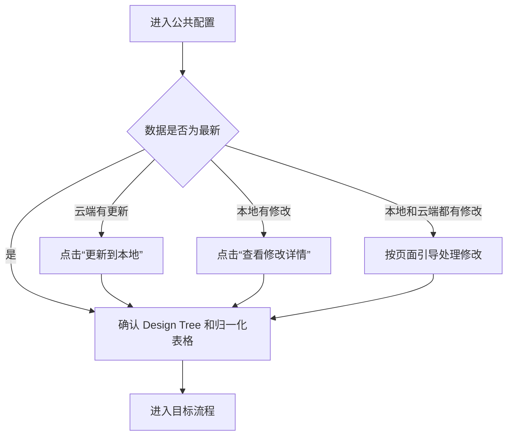

# HiSalad 五分钟快速上手

本文介绍如何在 VS Code 中使用 HiSalad 打开项目、完成公共配置、运行 Hibist、Sailor 或 Lander 流程，以及查看执行结果。

本文默认您已经熟悉 Hibist、Sailor 和 Lander 的使用方法，仅说明 HiSalad 插件中的操作。

## 开始前

请确认：

- 已安装并启用 HiSalad 插件。
- 已登录公司网络及相关服务。
- 已准备好需要使用的项目，或已获得项目访问权限。

如果拿到的是 `.vsix` 安装包，可在 VS Code 的“扩展”页面中选择“从 VSIX 安装”，然后按照提示重新加载窗口。

> **截图占位 1：安装 HiSalad**  
> 建议截取 VS Code“扩展”页面和右上角“从 VSIX 安装”入口，并标出 HiSalad 已启用的状态。  
> 建议文件名：`images/quick-start-01-install.png`

## 1. 打开 HiSalad

在 VS Code 左侧活动栏中点击 **HiSalad** 图标，打开 **DFT Flows** 导航。

如果活动栏中没有显示 HiSalad，也可以按 `Ctrl+Shift+P` 打开命令面板，输入并运行：

```text
HiSalad: Open Home
```

随后点击左侧导航中的 **项目主页**。

> **截图占位 2：打开 HiSalad**  
> 建议截取完整的 VS Code 窗口，并用编号标出：① HiSalad 活动栏图标；② DFT Flows 导航；③“项目主页”。  
> 建议文件名：`images/quick-start-02-open-hisalad.png`

## 2. 在项目主页进入项目

项目主页是使用 HiSalad 的起点。在这里可以查找项目、打开本地项目，并进入各项 DFT 流程。

首次使用时，请先确认页面显示的当前用户正确，然后选择以下一种方式进入项目：

- **已有本地项目**：点击 **打开本地项目**，选择项目所在文件夹。
- **项目列表中的项目**：在“我的项目”中搜索目标项目，然后进入该项目。
- **继续上次项目**：点击 **进入上次项目**。

项目打开后，请确认 VS Code 已加载正确的项目，并且项目主页显示的项目名称符合预期。

> **截图占位 3：项目主页**  
> 建议截取完整的 HiSalad 项目主页，并用编号标出：① 当前用户；② 打开本地项目；③ 进入上次项目；④ 项目搜索框；⑤ 我的项目列表；⑥ 流程入口。  
> 截图前请隐藏工号、项目名称、路径等敏感信息。  
> 建议文件名：`images/quick-start-03-project-home.png`

> **提示**  
> 如果目标项目不在列表中，请先刷新项目列表。如果仍然找不到，请确认自己是否具有该项目的访问权限。

## 3. 完成公共配置

进入项目后，点击左侧导航或顶部导航中的 **公共配置**。

在公共配置页面中：

1. 检查 Data 和当前项目数据的状态。
2. 如果页面提示云端有更新，点击 **更新到本地**。
3. 如果需要使用其他工作版本，请选择或新建对应的工作版本。
4. 确认本次流程需要使用的 Design Tree 和归一化表格。
5. 页面显示数据已是最新、所需内容完整后，再进入目标流程。



> **截图占位 4：公共配置**  
> 建议截取公共配置页面，并标出：① 数据状态；②“更新到本地”；③ 工作版本；④“查看修改详情”；⑤ Design Tree；⑥ 归一化表格。  
> 建议文件名：`images/quick-start-04-common-config.png`

如果页面提示本地和云端都有修改，请不要直接关闭提示。按照页面给出的步骤检查并保护本地内容，完成合并后再继续。

## 4. 进入目标流程

从左侧 DFT Flows 导航、顶部导航或项目主页选择需要使用的流程：

- **设计流程 (Hibist)**
- **设计流程 (Sailor)**
- **仿真验证 (Lander)**

三类流程在 HiSalad 中的基本操作方式一致：


> **截图占位 5：选择目标流程**  
> 建议截取带有顶部导航和左侧 DFT Flows 导航的页面，标出 Hibist、Sailor、Lander 三个入口。  
> 建议文件名：`images/quick-start-05-select-flow.png`

## 5. 配置并运行任务

进入目标流程后，按照页面顶部的步骤完成操作。

### 环境配置

1. 选择本次需要使用的模块或 Mode。
2. 确认默认配置；如有需要，切换到特殊配置。
3. 检查工具、版本、路径以及运行资源。
4. 确认页面没有缺失项或错误提示。

### 配置执行

1. 进入 **配置执行**。
2. 选择需要执行的模块、Mode 或任务。
3. 检查执行范围、运行步骤和资源配置。
4. 点击页面中的 **运行** 按钮。
5. 如果出现确认窗口，请再次检查任务范围，然后确认运行。

任务提交后，页面会显示运行状态。点击任务节点可以查看该节点的详细信息；运行中的任务可以停止，失败的节点可以根据页面提供的操作重新运行。

> **截图占位 6：配置并运行任务**  
> 建议选择 Hibist、Sailor 或 Lander 中的一种流程作为示例，分别标出：① 环境配置；② 配置执行；③ 模块或 Mode 选择；④ 执行范围；⑤ 资源配置；⑥“运行”按钮。  
> 建议文件名：`images/quick-start-06-run-task.png`

> **提示**  
> 如果“运行”按钮不可用，请检查是否已经选择执行对象、执行范围和运行资源，并确认页面中没有未完成的必填项。

## 6. 查看运行状态和结果

运行任务后，进入 **结果查看**，然后打开 **执行历史**。

1. 在列表中找到刚刚运行的任务。
2. 查看任务的整体状态、开始时间和结束时间。
3. 点击任务记录，进入执行记录详情。
4. 点击具体节点查看命令、日志文件和运行时间。
5. 根据需要打开结果文件、日志或报告。

| 状态 | 含义 | 建议操作 |
| --- | --- | --- |
| 等待中 | 任务尚未开始 | 等待运行资源，稍后刷新状态 |
| 运行中 | 任务正在执行 | 查看任务节点和实时日志 |
| 成功 | 任务已正常完成 | 打开结果文件或报告 |
| 失败 | 某个步骤执行失败 | 打开失败节点并查看日志 |
| 已停止 | 任务已被取消或终止 | 确认原因后重新运行 |
| 已跳过 | 当前步骤没有执行 | 检查本次选择的执行范围 |

> **截图占位 7：执行历史与结果**  
> 建议截取“结果查看”页面，并标出：① 执行历史；② 任务状态；③ 执行 ID；④ 任务详情入口；⑤ 日志文件；⑥ 结果或报告入口。  
> 建议文件名：`images/quick-start-07-results.png`

## 常见问题

### 看不到 HiSalad 图标

1. 打开 VS Code 的“扩展”页面。
2. 确认 HiSalad 已安装且处于启用状态。
3. 按 `Ctrl+Shift+P`，运行 `HiSalad: Open Home`。
4. 如果仍未显示，请重新加载 VS Code 窗口。

### 当前项目不正确

返回 **项目主页**，重新搜索或打开正确的项目。进入流程前，再次确认当前项目名称。

### 页面提示“存在未保存的更改”

如果需要保留当前设置，请取消页面切换并完成保存；如果确认不需要这些更改，再选择离开当前页面。

### 数据不是最新

返回 **公共配置**，检查数据状态并点击 **更新到本地**。如果本地也有修改，请先点击 **查看修改详情**，并按页面引导处理。

### 运行按钮不可用

检查是否已经选择模块或 Mode、执行范围、运行步骤和运行资源，并处理页面显示的必填项或错误提示。

### 任务执行失败

进入 **结果查看 > 执行历史**，打开失败任务，再打开失败节点的日志。根据日志提示调整配置后重新运行。

### VS Code 界面布局发生变化

按 `Ctrl+Shift+P` 打开命令面板，运行：

```text
HiSalad: Restore VS Code Layout
```

## 快速回顾


完成以上步骤后，您已经能够通过 HiSalad 完成一次基本的项目流程操作。
